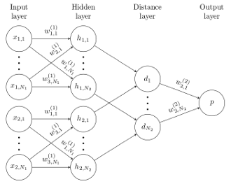
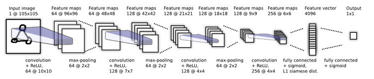
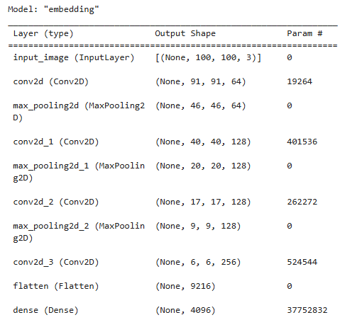
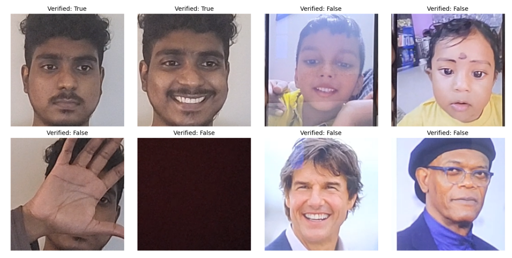

# Siamese Neural Network for Face Verification 🔍🧠

This project implements a **Siamese Neural Network** using TensorFlow for real-time **face verification**. The goal is to determine whether two facial images belong to the same person.

![alt-text][click to read the paper](oneshot1.pdf)


## 📌 Objective

Build and train a deep learning model capable of learning face embeddings and verifying identity based on facial similarity. This has real-world applications in:

- 🔐 Authentication systems  
- 🧑‍💻 Access control  
- 🧠 Few-shot learning setups


## 📌 Project Overview

- Capture face images from a webcam for Anchor and Positive samples.
- Use the **Labeled Faces in the Wild (LFW)** dataset as Negative samples.
- Preprocess and format the dataset for training.
- Build a **custom Siamese model** using TensorFlow's Functional API.
- Train the model to learn **face embeddings** and compute similarity.
- Perform real-time face verification using the trained model.


## 📊 Dependencies

- Python ≥ 3.7  
- TensorFlow  
- NumPy  
- OpenCV  
- Matplotlib  
- uuid, os, shutil

## 🧪 Features & Workflow

1. **Data Collection**
   - Webcam captures anchor & positive face images.
   - LFW dataset used for negative examples.

2. **Preprocessing**
   - Images resized and normalized.
   - Triplet dataset generated (Anchor, Positive, Negative).

3. **Model Architecture**
   - Built using **TensorFlow Functional API**.
   - Custom embedding model with shared weights.
   - Distance layer for similarity comparison.

4. **Training**
   - Loss: **Contrastive loss** or **Triplet Loss**.
   - Training loop uses TensorFlow’s `tf.GradientTape`.

5. **Verification**
   - Once trained, the model verifies identity in real-time.
   - Face match threshold customizable for accuracy vs. flexibility.

---

## 🧠 Model Architecture

This project uses a **Siamese Neural Network** architecture designed for face verification tasks. It compares two input images by passing them through a shared CNN (embedding model), computes the L1 distance between their embeddings, and predicts similarity using a sigmoid layer.



### 🔷 Embedding Model (`make_embedding`)



Extracts high-dimensional face embeddings from images.



---

### 🔁 Siamese Model (`make_siamese_model`)

Compares two face embeddings and predicts whether they belong to the same person.

- **Inputs:** Anchor image & Validation image (both 100x100 RGB)
- **Embedding Extraction:** Uses the shared `make_embedding()` model
- **Distance Metric:** Custom L1 distance layer
- **Classifier:** Dense(1, activation='sigmoid')

```python
# Custom L1 Distance Layer
class L1Dist(Layer):
    def call(self, input_embedding, validation_embedding):
        return tf.math.abs(input_embedding - validation_embedding)

```


## 🎮 Webcam Controls

| Key | Action                  |
|-----|--------------------------|
| `A` | Capture **Anchor** image |
| `P` | Capture **Positive** image |
| `Q` | Quit webcam feed         |


🧪 Final Output: A probability score indicating face similarity:

1 → Same person

0 → Different person

## 📈 Example Output



After training, the model can verify if a test image matches a known person based on learned facial embeddings.

## 🧠 Future Improvements

- Add GUI interface for user-friendly verification.
- Expand dataset for multi-person classification.
- Implement model saving and reloading pipeline.

---

## 🙌 Author

**Sajeesh K Mohanan** 
🔗 [LinkedIn](https://www.linkedin.com/in/sajeesh-k-mohanan-7a437218b/)  